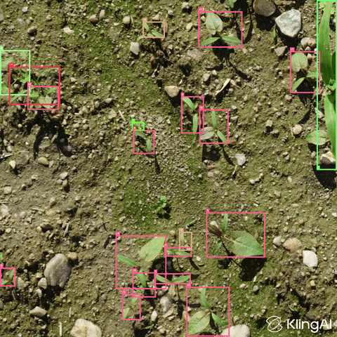

# High-Performance Zero-Host-Copy Inference Pipeline (C++/CUDA)


**Author:** Igor Khozhanov

**Contact:** khozhanov@gmail.com

**Copyright:** © 2026 Igor Khozhanov. All Rights Reserved.

---

## 🎬 Real-Time Output
*Processing input with Yolov8m 1024x1024 INT8 @ ~165 FPS on RTX 3060 Ti and @ ~38 FPS on Jetson Orin Nano.*




---

## 🏗️ Architecture & Project Status

This project serves as a comprehensive demonstration of a high-performance **Zero-Host-Copy** video inference pipeline, designed to minimize CPU-GPU bandwidth bottlenecks. The architecture ensures that data remains entirely on the VRAM from decoding through inference to post-processing. 

The pipeline supports full end-to-end detection and tracking using TensorRT and ONNX backends, powered by mathematically verified custom CUDA kernels.

* **Hardware-in-the-Loop CI/CD:** Fully automated multi-architecture Docker build and testing pipeline via GitHub Actions. Utilizes self-hosted RTX 3060 Ti (x64) and Jetson Orin Nano (ARM64) runners with persistent host-level TensorRT engine caching to accelerate GPU unit testing.


| Module / Stage | Status | Notes |
| :--- | :--- | :--- |
| **FFMpeg Source** | ✅ **Stable** | Handles stream connection and packet extraction. |
|**Stub Detector** | ✅ **Stable** | Pass-through module, validated for pipeline latency profiling. |
| **Output / NVJpeg** | ✅ **Stable** | Saves frames from GPU memory to disk as separate *.jpg images. |
| **Inference Pipeline** | ✅ **Stable** | Connects all the stages together. |
| **ONNX Detector** | ✅ **Optimized** | FP32 Inference optimized (~38 FPS). |
| **TensorRT Detector** | ✅ **Stable** | Engine builder & `enqueueV3` implemented. |
| **Object Tracker** | ✅ **Stable** | Kernels for position prediction, IOU matching, velocity filtering. |
| **Post-Processing** | ✅ **Stable** | Custom CUDA kernels for YOLOv8 output decoding & NMS. |
| **Jetson Port** | ✅ **Stable** | Native CUDA/TRT pipeline operational. Integrated Jetson Multimedia API (MMAPI) for hardware-accelerated JPEG decoding/encoding. |

---

## 📥 Model Setup (Required)

This repository contains the **Inference Engine** (MIT Licensed). It does **not** include pre-trained model weights.

To reproduce the demo results (Crop & Weed Detection), you must download pre-trained YOLOv8 model separately.

### Download the Model
The model is hosted in the research repository (AGPL-3.0):

* **Download:** [`best_int8.onnx`](https://github.com/Igkho/CropAndWeedDetection/releases) 
* **License:** AGPL-3.0 (Derived from Ultralytics YOLOv8)

## ⚙️ Compatibility & Dependencies

### Supported Platforms
* ✅ Linux x64 (Verified on Ubuntu 24.04 / RTX 3060 Ti)
* ✅ Nvidia Jetson Orin Nano (Verified on Ubuntu 22.04 / JetPack 6.1)

Note: Jetson currently requires passing a directory of images (`-i ./frames/`) instead of an `.mp4` file.

### Dependencies (For Native Compilation)

* CMake 3.19+
* CUDA Toolkit (12.x)
* TensorRT 10.x+
* **cuDNN 8.x/9.x**: Required at runtime if utilizing the ONNX Runtime CUDA Execution Provider. *(Ensure `libcudnn.so` is in your `LD_LIBRARY_PATH` or installed system-wide).*
* **FFmpeg**: Required.  *(Linux x64 Users: Install via 'apt' or build from source with `--enable-shared.*

## Build & Run (PC Native - Linux x64)

```bash
git clone https://github.com/Igkho/ZeroHostCopyInference.git
cd ZeroHostCopyInference

mkdir build
mv ~/Downloads/best_int8.onnx ./build/

cd build
cmake ..
make -j$(nproc)
```

### Run pipeline 

```bash
./ZeroCopyInference -i ../video/Moving.mp4 --backend trt --model best_int8.onnx -b 16 -o Moving
```

### Run tests

```bash
./ZeroCopyInferenceTests --model best_int8.onnx
```

## Build & Run (Jetson Native)

```bash
git clone https://github.com/Igkho/ZeroHostCopyInference.git
cd ZeroHostCopyInference

mkdir build
mv ~/Downloads/best_int8.onnx ./build/

cd build
cmake ..
make -j$(nproc)
```

### Run pipeline
Note: Jetson requires a directory of frames (fetched automatically by cmake) as input instead of an .mp4

```bash
./ZeroCopyInference -i ../frames/ --backend trt --model best_int8.onnx -b 16 -o Moving
```

### Run tests

```bash
./ZeroCopyInferenceTests --model best_int8.onnx
```


## Quick Start (Docker - Linux x64)
No C++ compilation required. Requires NVIDIA Container Toolkit.

### Run pipeline

```bash

git clone https://github.com/Igkho/ZeroHostCopyInference.git
cd ZeroHostCopyInference

mkdir models
mv ~/Downloads/best_int8.onnx ./models/
bash download_frames_data.sh

docker run --rm --gpus all \
  -v $(pwd)/video:/app/video \
  -v $(pwd)/models:/app/models \
  ghcr.io/igkho/zerohostcopyinference:latest-x64 \
  -i /app/video/Moving.mp4 \
  --backend trt \
  --model /app/models/best_int8.onnx \
  -b 16 \
  -o /app/video/output
```

### Run GPU unit tests

```bash
git clone https://github.com/Igkho/ZeroHostCopyInference.git
cd ZeroHostCopyInference

mkdir models
mv ~/Downloads/best_int8.onnx ./models/

docker run --rm --gpus all \
  -v $(pwd)/video:/app/video \
  -v $(pwd)/models:/app/models \
  --entrypoint /app/build/ZeroCopyInferenceTests \
    ghcr.io/igkho/zerohostcopyinference:latest-x64 \
  --model /app/models/best_int8.onnx
```

## Quick Start (Docker - Jetson Orin Nano)
Requires the --runtime=nvidia flag to access L4T hardware encoders and UMA.

⚠️ Critical Note for Jetson 8GB Users: Compiling the TensorRT .engine from the .onnx model requires significant temporary UMA memory. If this is your first time running the pipeline (and the engine is not yet cached), you must configure an 8GB swap file on your Jetson host OS to prevent Out-Of-Memory (OOM) crashes during the engine profiling phase.

```bash
sudo fallocate -l 8G /mnt/8GB.swap
sudo mkswap /mnt/8GB.swap
sudo swapon /mnt/8GB.swap
```


### Run pipeline

```bash

git clone https://github.com/Igkho/ZeroHostCopyInference.git
cd ZeroHostCopyInference

mkdir models
mv ~/Downloads/best_int8.onnx ./models/
bash download_frames_data.sh

docker run --rm --runtime=nvidia \
  -v $(pwd)/frames:/app/frames \
  -v $(pwd)/models:/app/models \
  ghcr.io/igkho/zerohostcopyinference:latest-jetson \
  -i /app/frames/ \
  --backend trt \
  --model /app/models/best_int8.onnx \
  -b 16 \
  -o /app/frames/output
```

### Run GPU unit tests

```bash
git clone https://github.com/Igkho/ZeroHostCopyInference.git
cd ZeroHostCopyInference

mkdir models
mv ~/Downloads/best_int8.onnx ./models/

docker run --rm --runtime=nvidia \
  -v $(pwd)/frames:/app/frames \
  -v $(pwd)/models:/app/models \
  --entrypoint /app/build/ZeroCopyInferenceTests \
    ghcr.io/igkho/zerohostcopyinference:latest-jetson \
  --model /app/models/best_int8.onnx
```

## 🚀 Performance Benchmarks

Benchmarks performed on **NVIDIA RTX 3060 Ti** and on **NVIDIA Jetson Orin Nano**

**Input:** 1440p Video Stream or directory of jpeg images.

**Model:** YOLOv8 Medium (YOLOv8m) @ 1024x1024 Resolution.

### 1. Infrastructure Ceiling (Stub Mode) - RTX 3060 Ti
To measure the raw overhead of the pipeline architecture (I/O latency), a pass-through (Stub) detector should be used.

| Metric | Result | Notes |
| :--- | :--- | :--- |
| **Throughput** | **~300 FPS** | Maximum theoretical speed without AI model. |
| **Latency** | **3.3 ms** | Combined Decoding + Memory Management overhead. |

### 2. Real-World Inference (TensorRT INT8 Mode) - RTX 3060 Ti
Running **YOLOv8m** (Explicitly Quantized INT8) with full object tracking and NVJpeg output.

| Metric | Result | Notes |
| :--- | :--- | :--- |
| **Total Throughput** | **~165 FPS** | Wall time (End-to-End). **>2.5x Real-Time**. |
| **Bottleneck Shift** | **Decoding** | Inference is now so fast (3.36ms) that Video Decoding (4.83ms) has become the primary bottleneck. |

**Workload Distribution (Active Work):**
* **Decoding (Source):** ~4.83 ms/frame (46.91% load)
* **Inference (Detector):** ~3.36 ms/frame (32.66% load)
* **Storage (Sink):** ~2.10 ms/frame (20.43% load)


### 3. Backend & Precision Comparison - RTX 3060 Ti
Both **TensorRT** (Highly Optimized) and **ONNX Runtime** (Generic Compatibility) are supported.

| Backend / Precision | FPS | Latency (Inference) | Speedup Factor | Notes |
| :--- | :--- | :--- | :--- | :--- |
| **TensorRT (INT8)** | **~164.8** | **~3.36 ms** | **1.4x** | Maximum performance. **Recommended.** |
| **TensorRT (FP16)** | **~118.1** | **~5.58 ms** | **1.0x (Ref)** | Baseline hardware acceleration. |
| **ONNX Runtime** | **~38.4** | **~24.2 ms** | **0.33x** | Generic execution. Useful for testing new models. |

### 4. Edge Performance - Jetson Orin Nano 8GB

**Scenario:** 1440x1440 Input Resolution (Directory of JPEG frames).

**Model:** YOLOv8 Medium (YOLOv8m) 1024x1024.

*ONNX Runtime** is not supported.

| Metric | Result, FPS | Notes |
| :--- | :--- | :--- |
| **Infrastructure Ceiling (Stub)** | **~160** | Maximum pipeline speed utilizing dedicated MMAPI hardware engine (no model). |
| **TensorRT (FP16) + NVJpeg** | **~22.2** | Baseline hardware acceleration (CUDA NVJPEG). |
| **TensorRT (INT8) + NVJpeg** | **~31.4** | Fast inference, with decode/encode tasks using  CUDA SMs. |
| **TensorRT (INT8) + MMAPI** | **~38.0** | New Peak. I/O offloaded to dedicated ASICs. |

## ⚖️ License

The source code of this project is licensed under the **MIT License**. You are free to use, modify, and distribute this infrastructure code for any purpose, including commercial applications.

### 🛑 Asset & Model Licensing Exceptions

While the code is MIT-licensed, the **assets and models** used in this repository are subject to different terms. Please review them carefully before redistributing:

#### 1. Video Assets (Non-Commercial Only)
* **Files:** Content located in the `video/` directory (e.g., `Moving.mp4`, `Moving_annotated.gif`).
* **Source:** Generated using **KlingAI (Free Tier)**.
* **Terms:** These assets are provided for **demonstration and educational purposes only**. They are **strictly non-commercial**. You may not use these specific video files in any commercial product or service.
* **Attribution:** The watermarks on these videos must remain intact as per the platform's Terms of Service.

### 2. Model Licensing

* **Example:** If you use **YOLOv8** (Ultralytics) with this pipeline, be aware that YOLOv8 is licensed under **AGPL-3.0**.
* **Implication:** Integrating an AGPL-3.0 model may legally require your entire combined application to comply with AGPL-3.0 terms (i.e., open-sourcing your entire project).

**User Responsibility:** This repository provides the *execution engine* only. No models are bundled. You are responsible for verifying and complying with the license of any specific ONNX/TensorRT model you choose to load.